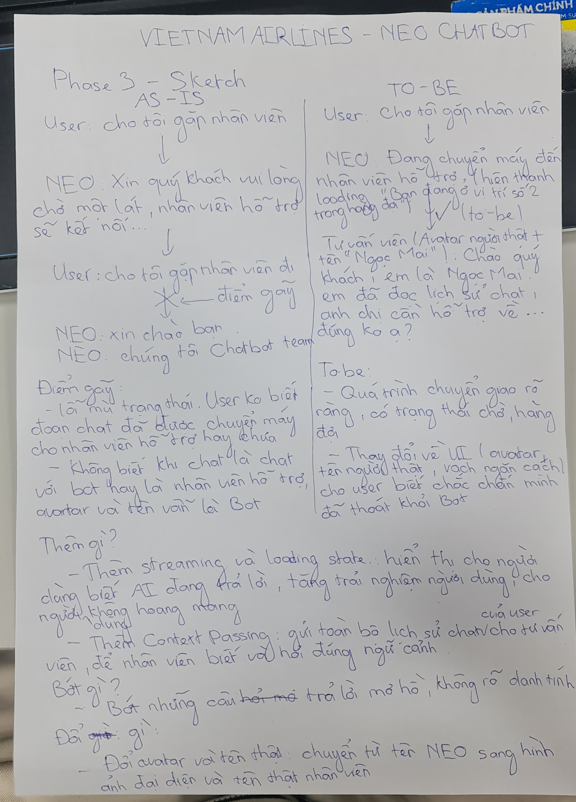
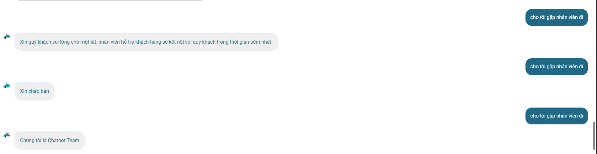
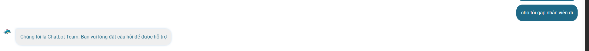
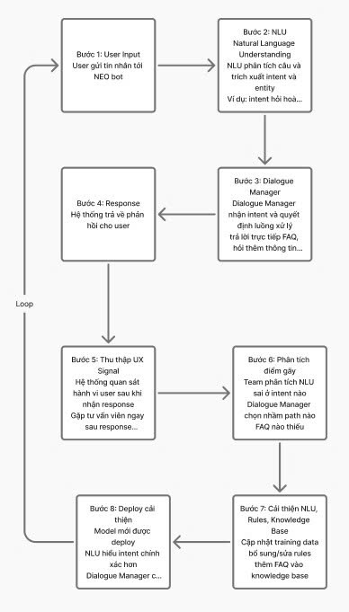

# Bài tập UX: phân tích sản phẩm AI thật

**Thời gian:** 40 phút | **Cá nhân** | **Output:** sketch giấy, nộp cuối bài

---

## Chọn 1 sản phẩm

| Sản phẩm | AI feature | Truy cập |
|----------|-----------|---------|
| MoMo — Trợ thủ AI Moni | Phân loại chi tiêu, chatbot tài chính | App MoMo |
| Vietnam Airlines — Chatbot NEO | Chatbot hỗ trợ khách hàng, tra cứu chuyến bay | vietnamairlines.com hoặc Zalo VNA |
| V-App — Trợ lý ảo V-AI | Trợ lý voice/text, gợi ý theo context | App V-App |

---

### Phần 1 — Khám phá: Chatbot NEO (Vietnam Airlines)

**1. Trước khi dùng (Kỳ vọng Marketing)**
*   **Lời hứa:** Là "Trợ lý ảo thông minh" 24/7, dùng AI (NLU/NLP) để thấu hiểu ngôn ngữ tự nhiên.
*   **Kỳ vọng:** Giải quyết tác vụ nhanh chóng, tiện lợi và có khả năng cá nhân hóa người dùng.

**2. Dùng thử (Thực tế UI & Phản ứng của AI)**

*   **Sự thay đổi Giao diện (UI) & Nút bấm:**
    *   **Nút Menu có sẵn:** Khuyến khích user bấm nút (Quick replies) thay vì gõ chữ dài để giảm tải nhận thức.
    *   **Nút "Gặp tư vấn viên":** Không hiện từ đầu, chỉ xuất hiện làm "phao cứu sinh" khi hệ thống không giải quyết được.
    *   **Form Đánh giá (Rating UI):** Tự động mở rộng (thêm checkbox & ô nhập chữ) nếu người dùng đánh giá sao thấp.
    *   **Đính kèm:** UI hỗ trợ tải lên hình ảnh/tài liệu.

*   **Phản ứng của AI:**
    *   **Tốc độ & Thấu hiểu:** Trả lời câu hỏi lâu. Hiểu cực tốt các từ khóa ngắn, nhưng dễ bối rối với câu dài/phức tạp.
    *   **Xử lý khi "Không chắc chắn":** AI không im lặng. Nó phản hồi xin lỗi và chủ động gợi ý liên hệ tư vấn viên.

## Phần 2 — Phân tích 4 paths

Dựa trên log hội thoại thực tế, dưới đây là phần mổ xẻ trải nghiệm của Chatbot NEO theo framework 4 Paths:

| Path | Nhận xét thực tế từ đoạn chat |
| :--- | :--- |
| **1. Khi AI đúng** *(Quy định lồng chó 15kg & VNeID)* | - **User thấy gì:** Trải nghiệm rất tốt. Bot đưa ra câu trả lời dài, được định dạng rõ ràng bằng gạch đầu dòng (bullet points). - **Hệ thống confirm:** Đi thẳng vào trọng tâm điều kiện (VD: *nhận diện được 15kg > 6kg nên từ chối cho lên khoang, nhận diện được VNeID mức 2 hợp lệ*). Bot đưa ra ngay giải pháp thay thế (ký gửi/hàng hóa). |
| **2. Khi AI không chắc** *(Xin danh sách chuyến bay hôm nay)* | - **Hệ thống xử lý:** Bot không có khả năng hiểu các câu hỏi mở hoặc truy xuất danh sách động. Thay vào đó, nó **ép user phải đi vào luồng có sẵn** bằng cách hiển thị các nút bấm rập khuôn (*"Quý khách muốn tra cứu theo phương án nào ạ"*).  - Nhược điểm là nó bỏ qua hoàn toàn ý định ban đầu của user để bẻ lái về quy trình tĩnh của hãng. |
| **3. Khi AI sai / Không hiểu** *(Nhập sai mã VF9, VF8 và cãi lại bot)* | - **User biết bằng cách nào:** Bot báo lỗi trực tiếp (*"Số hiệu chuyến bay không hợp lệ"*). - **Sửa bằng cách nào:** Gần như **không có cơ chế sửa mượt mà**. Thậm chí khi user phản hồi (*"bạn sai rồi..."*), bot đổ lỗi ngược lại (*"thông tin Quý khách cung cấp chưa chính xác"*) và tệ hơn là đòi **đóng hội thoại, xin đánh giá sao** ngay lập tức. - **Bao nhiêu bước:** Bế tắc. User phải tự thoát ra gọi tổng đài viên. |
| **4. Khi user mất niềm tin** *(Cố tình nhập câu lệnh test / Prompt Injection)* | - **Có exit/fallback không:** **Không có**. Khi user nhập một câu hoàn toàn ngoài luồng, bot bị kẹt trong trạng thái hệ thống cũ. Nó liên tục lặp lại câu hỏi ép user phải đóng tác vụ (*"vui lòng xác nhận lại việc hủy yêu cầu..."*) trước khi cho phép chat tiếp. Không có nút "Gặp nhân viên hỗ trợ" nào xuất hiện. |

---

## Tự phân tích

**1. Path nào sản phẩm xử lý tốt nhất? Tại sao?**
* **Path 1 (Khi AI đúng)** là điểm sáng lớn nhất. Nhờ hệ thống cơ sở dữ liệu (Knowledge Base) về quy định hàng không được chuẩn bị kỹ, NEO trả lời các câu hỏi về chính sách, hành lý, giấy tờ bay cực kỳ xuất sắc. Nó biết phân tách các trường hợp (Công dân VN vs Nước ngoài) và đưa ra các con số định lượng chính xác (10 tuần tuổi, 32kg, 30 ngày).

**2. Path nào yếu nhất hoặc không tồn tại?**
* **Path 4 (Lối thoát hiểm)** và **Path 3 (Sửa sai)** là yếu nhất. 
* Hệ thống bị thiết kế theo tư duy "Slot-filling" (điền vào chỗ trống) rất cứng nhắc. Một khi user lỡ kích hoạt luồng "Tra cứu", họ bị nhốt trong luồng đó.
* Hoàn toàn thiếu vắng cơ chế Handoff (chuyển giao cho người thật) khi người dùng bắt đầu nhập dữ liệu sai nhiều lần hoặc hỏi ngoài luồng.

**3. Kỳ vọng từ marketing khớp thực tế không? Gap ở đâu?**
* **Kỳ vọng:** Trợ lý ảo thông minh, thấu hiểu ý định người dùng bằng ngôn ngữ tự nhiên.
* **Thực tế:** NEO chỉ "thông minh" ở các tác vụ hỏi đáp chính sách (Q&A / RAG). Ở các tác vụ cần thực thi (Task-oriented) như tra cứu vé, nó bộc lộ rõ là một hệ thống Rule-based cũ kỹ. 
* **Gap (Khoảng trống):** Sự thiếu linh hoạt trong việc chuyển đổi ngữ cảnh (Context-switching). Một AI có UX tốt phải biết cách thoát ra khỏi luồng hiện tại để đáp ứng câu hỏi mới của khách, thay vì bắt ép khách phải gõ xác nhận hủy tác vụ cũ.

## Phần 3 — Sketch "làm tốt hơn"
**Sketch**

**Ảnh đoạn chat với AI NEO**

## Phần 4 — Data flywheel

---

## Nộp bài

Mỗi người nộp sketch giấy + ghi chú phân tích 4 paths. Đây là **điểm cá nhân**.

**Nice to have:** screenshot màn hình app + annotate (khoanh, ghi chú) chỗ hay / chỗ gãy. Nộp kèm sketch.

---

## Tiêu chí chấm (10 điểm + bonus)

| Tiêu chí | Điểm |
|----------|------|
| Phân tích 4 paths đủ + nhận xét path yếu nhất | 4 |
| Sketch as-is + to-be rõ ràng | 4 |
| Nhận xét gap marketing vs thực tế | 2 |
| **Bonus:** nhóm vote sketch hay nhất | +bonus |

---

*Bài tập UX — Ngày 5 — VinUni A20 — AI Thực Chiến · 2026*
